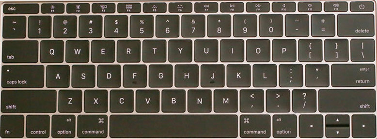
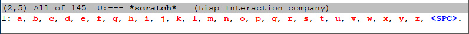

# 畅玩emacs：一种全新的emacs快捷键使用方式
感谢 @ [owensys](https://emacs-china.org/u/owensys) 在原帖 [我的emacs按键使用方式-用shift](https://emacs-china.org/t/emacs-shift/8508)中的回复

如果你是emacs新手或者觉得emacs的默认按键设置非常难用，本文将帮助你找到一种适合自己的快捷键使用方式。

注意：本文主要针对主流笔记本键盘布局(类似下图)，需要你对emacs hydra有一些了解。



>苹果第一款12寸macbook的键盘布局

一句话概括全文：不要再用你的小拇指按ctrl键了。

emacs用多了小拇指疼，关节疼，得腱鞘炎等一直是emacs被吐糟的地方，但事实上重度emacs用户通常都不会完全使用原生快捷键，会按自己的方式对快捷键进行一番改进，使emacs用起来足够顺手，甚至是全键盘操作，不用鼠标。

## 改进emacs的快捷键操作通常有这几种方法：

1，交换ctrl和caps lock键；

   我用过这一办法，产生的主要问题是换电脑换系统后和用别人电脑（或别人用我电脑）时会不适应，如果你的电脑并不完全是自己使用，而是公共财产（如属于公司等），显然不适合在系统级别修改键盘映射，这会影响到所有用户和电脑内的所有软件。

2，使用evil;

   使用emacs内的vi模拟器evil，如果本身是vim用户，在emacs内使用vi是个好办法，但也很多人并不喜欢vi，希望进入编辑器后直接就能打字。如果中文输入法用得比较多，中文输入法下使用vi模式切换时会有一些问题要解决，但显然没有英文输入顺手。

3，换一个更适合emacs的键盘

   用HHKB pro，Filco ，静电容键盘，自定义键位的poker，人体工程学键盘…因人而异，这些都是不错的选择，但我个人觉得普通笔记本自带键盘就不错（只要shift键足够大）     

4，其它方法

   使用Dvorak键位，掌压ctrl键，中指按ctrl键，ctrl键和alt交换等等。

## 使用shift键

  开头已说点明本文针对主流笔记本键盘布局，而主流笔记本键盘布局对ctrl键都很不友好，ctrl键很小，甚至只有左ctrl键，没有右ctrl键，但shift键却没有缩水，通常比capslock键，enter键都要大一些。
  
  如果是传统台式电脑键盘，enter键，右shift通常比capslock键，左shift要大些，并不是对称的，笔记本则设计成左右大小对称的比较多。
  
  左右shift键就是键盘上仅次于空格的第二大键，当我发现我在emacs上并没有充分利用起shift键，shift键使用的频率还不如alt键，ctrl键时，我就想能不能把shift键当ctrl键用。尝试之后发现可行。
  
  因为emacs不能识别shift键按下，把shift键当快捷键用后导致无法按caps lock键后正常输入大写字母，caps lock键的作用成为了类似vim中的esc键，也成了一种模式切换。
  
  首先要解决大写字母输入的问题，我用hydra写了一个函数来解决。hydra代码如下：

``` elisp
 (defhydra hydra-caps ()"l"
    ("a" (insert-char 65))("b" (insert-char 66))("c" (insert-char 67))
    ("d" (insert-char 68))("e" (insert-char 69))("f" (insert-char 70))
    ("g" (insert-char 71))("h" (insert-char 72))("i" (insert-char 73))
    ("j" (insert-char 74))("k" (insert-char 75))("l" (insert-char 76))
    ("m" (insert-char 77))("n" (insert-char 78))("o" (insert-char 79))
    ("p" (insert-char 80))("q" (insert-char 81))("r" (insert-char 82))
    ("s" (insert-char 83))("t" (insert-char 84))("u" (insert-char 85))
    ("v" (insert-char 86))("w" (insert-char 87))("x" (insert-char 88))
    ("y" (insert-char 89))("z" (insert-char 90))
    ("<SPC>" nil))
    (global-set-key (kbd "L") 'hydra-caps/body)
```

上面代码中看到我将其绑定到了shift+l键，L进入大写字母输入模式，空格退出大写字母输入模式，当然也可以按其它键退出大写字母输入状态。



>L进入大写字母输入模式

上面代码是连续输入多个大写字母的，如遇到编程时的驼峰命名法（DataBaseUser）时，大写输入状态连续换几次，这时需要有一个输入单个大写字母后立即退出大写字母输入状态的功能，我写了一个hydra函数来实现。代码如下：

``` elisp
(defhydra hydra-shift () ","
   ("a" (insert-char 65) :exit t)("b" (insert-char 66) :exit t)("c" (insert-char 67) :exit t)
   ("d" (insert-char 68) :exit t)("e" (insert-char 69) :exit t)("f" (insert-char 70) :exit t)
   ("g" (insert-char 71) :exit t)("h" (insert-char 72) :exit t)("i" (insert-char 73) :exit t)
   ("j" (insert-char 74) :exit t)("k" (insert-char 75) :exit t)("l" (insert-char 76) :exit t)
   ("m" (insert-char 77) :exit t)("n" (insert-char 78) :exit t)("o" (insert-char 79) :exit t)
   ("p" (insert-char 80) :exit t)("q" (insert-char 81) :exit t)("r" (insert-char 82) :exit t)
   ("s" (insert-char 83) :exit t)("t" (insert-char 84) :exit t)("u" (insert-char 85) :exit t)
   ("v" (insert-char 86) :exit t) ("w" (insert-char 87) :exit t)("x" (insert-char 88) :exit t)
   ("y" (insert-char 89) :exit t)("z" (insert-char 90) :exit t)("," (insert-char 44) :exit t)
   ("，" (insert-char 65292) :exit t)("<SPC>" counsel-switch-buffer "" :exit t);;切换buffer
   ("." counsel-imenu "" :exit t)("。" counsel-imenu "" :exit t)(";" nil)("；" nil))
   (global-set-key (kbd ",") 'hydra-shift/body)
   (global-set-key (kbd "，") 'hydra-shift/body)
```

上面代码中可以看到我绑定了“，”号进入单个大写字母输入状态，而输入原本的“，”号则需要按两次“，”键才能正常输入“，”号，而因为我在中文输入法下使用emacs比较多，我把中文的"，。；"符号都做了绑定，还加了些其它功能。

使用了“，”号后大写字母输入的问题完全解决，这时就可以自由使用shift来绑定emacs中让你不爽的快捷键了。 

比如常见的光标移动：
``` elisp
(global-set-key (kbd "P") 'previous-line)；与ctrl+p一致
(global-set-key (kbd "N") 'next-line);下移动光标
(global-set-key (kbd "F") 'forward-char);向前移动一个字符
(global-set-key (kbd "B") 'backward-char);向后移动一个字符
(global-set-key (kbd "A") 'move-beginning-of-line);移到行首
(global-set-key (kbd "E") 'move-end-of-line);移到行尾
```

注意：这里的用法不是取代emacs原生快捷键，是在emacs原生快捷键的基础上新增快捷键，可以与原生快捷键兼容一起共用。tab +shift，ctrl+shift这些在emacs下都还是以前的功能，不会有任何变化。

有一部分emacs用户不愿意改默认快捷键的原因是```很多个性化定制都是因为还没遇见更复杂的情况```，所以```迫不得已，尽量不改```。

但我这里的用法不是改快捷键是增加快捷键，默认快捷键一直都是可用状态，也不需要有切换成默认快捷键这个步骤，所有不会有```很多个性化定制都是因为还没遇见更复杂的情况```这个问题

快捷键这东西非常个性化，emacs用户通常是```用到哪儿绑到哪儿```，当我发现某个emacs快捷键有点难按，就用我的方法绑定一下即可，原生好按也就不用绑了。

举例：我发现最新版org-mode输入 <s后按tab不会展开了，在我针对org-mode的hydra键绑定里面加了两行elisp，然后在绑定快捷键解决。
```elisp
(defhydra hydra-org-mode () "org" 
  ;;……
  ("c" (progn (insert "#+BEGIN_SRC \n\n#+END_SRC")
          (move-end-of-line -1)) "org代码片段模版" :exit t)
)
(global-set-key (kbd "C") '());;清除C的默认绑定
(add-hook 'org-mode-hook (lambda ()
  ;;……
  (local-set-key (kbd "C") 'hydra-org-mode/body)
))
```

这里我绑定的快捷键是C_c，当然这个例子中的问题还有更好的解决办法，使用```(use-package org-tempo)```，<q <e 之类的也可以一并解决。这里感谢[@deerainw](https://emacs-china.org/u/deerainw)
## 最后补充

   这个修改只是在emacs层面改动有效，对键盘本身的按键映射没有影响，不会改了后电脑里其它的软件按键也跟着变，影响不到电脑里其它任何软件的正常使用。
   
   在vscode中也可以识别shift键，也可以用这个按键方法，而且不影响capslock键之后输入大写字母，vsc也有个叫hydra的插件，但完全不是emacs的hydra。
   
   emacs中有很多好玩的功能，需要在使用过程中才能发现。被称之为“神之编辑器”并不是浪得虚名。
